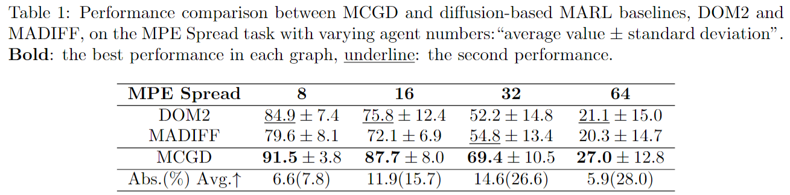
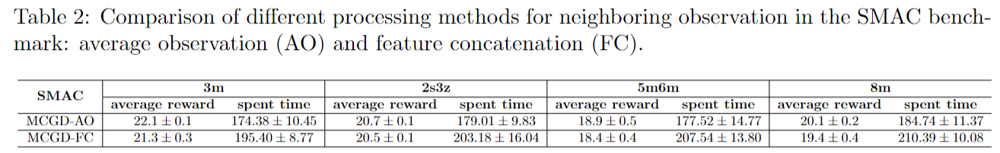
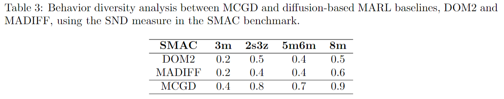
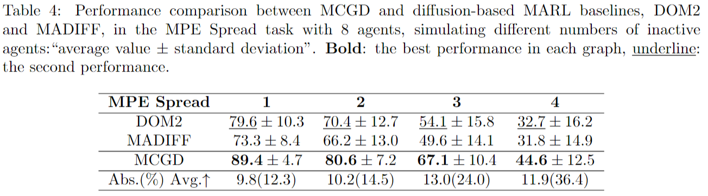
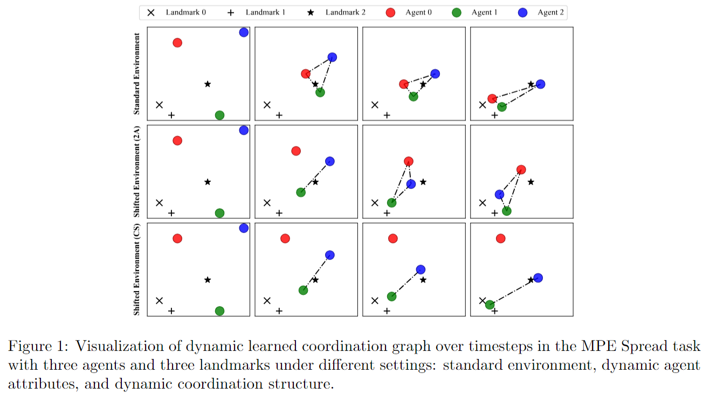
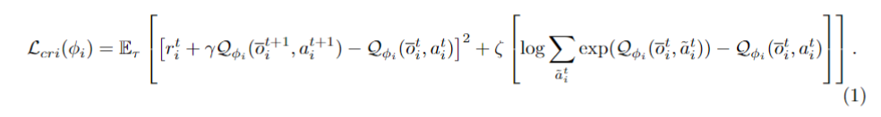

# Graph Diffusion for Robust Multi-Agent Coordination

## Supplemental Materials for Rebuttul

## Detailed Rebuttul for Each Reviewer

Due to character limits, we provide concise responses to each reviewer’s comments on OpenReview. For further clarification, please refer to the detailed rebuttal PDF available at the provided link. We confirm that it fully adheres to the conference’s anonymity requirements.
